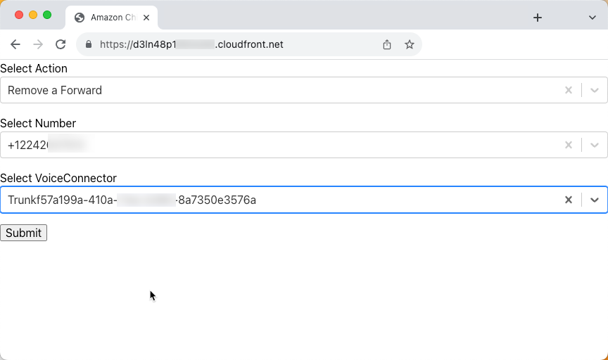
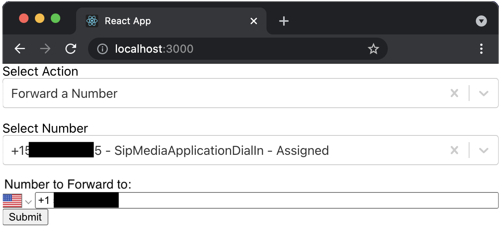

# Call Forwarding with Amazon Chime SDK PSTN Audio (SMA) service

This demo will build and configure several services within AWS so that you can forward calls using the Amazon Chime SDK via the [CallAndBridge](https://docs.aws.amazon.com/chime/latest/dg/call-and-bridge.html) action. A simple web app client hosted on CloudFront and protected by Cognito can be used to manage the forwarding of numbers.

## Overview


## Requirements

- node V18/npm [installed](https://www.npmjs.com/get-npm)
- yarn [installed](https://classic.yarnpkg.com/en/docs/install)
  - `npm install --global yarn`
- AWS CLI [installed](https://docs.aws.amazon.com/cli/latest/userguide/install-cliv2.html)
- AWS Credentials [configured](https://docs.aws.amazon.com/cli/latest/userguide/cli-configure-files.html) for the account/region that will be used for this demo (use us-east-1 or us-west-2 to align with SIP Media Application resources)
- Ability/Permissions to create Chime SIP Media Applications and Phone Numbers (ensure your [Service Quota](https://console.aws.amazon.com/servicequotas/home/services/chime/quotas) in us-east-1 for Phone Numbers have not been reached)
- Deployment must be done in us-east-1 or us-west-2 to align with SIP Media Application resources

## Deployment
- Clone this repo: `git clone https://github.com/aws-samples/amazon-chime-sma-call-forwarding`
- `cd amazon-chime-sma-call-forwarding`
- `yarn launch`
- Accept the prompts for CDK deployment

## Description

This deployment will build everything required (see below) such that you can make a telephone call to a new PSTN telephone number assigned to your AWS account from the Amazon Chime Phone Inventory, and forward that call to another telephone number. A simple web app, which is hosted on CloudFront allows you to update a DynamoDB table with call forwarding information as well as change numbers between the different Amazon Chime Product Types `SipMediaApplicationDialIn` or `VoiceConnector`. A Voice application Lambda function written in Python is used to forward numbers using the [CallandBridge](https://docs.aws.amazon.com/chime/latest/dg/call-and-bridge.html) action.

## Resources Created:
- Amazon Cognito UserPool - provides authentication for the webapp client
- Amazon API Gateway
- Amazon CloudFront Distribution - hosts the webapp client
- Amazon Chime PSTN Audio (aka SIP Media Application, or "SMA") service used to forward calls. Associated with the smaHandler Lambda function
- Amazon Chime SMA rule - used to route the provisioned PSTN telephone number to the smaLambda function
- Amazon Chime PSTN phone number - provisioned to use with the SIP Media Application rule
- Amazon DynamoDB Table - "calledNumber" DynamoDB table used to store where numbers should be forwarded to. Managed by the webapp client and queried by smaLambda function during call setup
- Amazon S3 Bucket - to store wav files (2 samples included) for playing customized messages.
- Amazon Lambda Functions
    - handlerLambda - A Lambda function written in Python that updates the Product Type of numbers in the Amazon Chime Phone Inventory and adds and removes numbers the DynamoDB table. This is fronted by an API Gateway. 
    - smaLambda - A Lambda function written in Python that is associated with the Amazon Chime SDK PSTN Audio service and used to forward calls using the CallandBridge action
- Voice Connector - Chime Voice Connector used to demonstrate changing Product Types of the phone number

## Additional Resources

- utils\createWav.py - Python script to create wav files using Polly
- wav_files\\\* - wav files uploaded to outgoingWav bucket for use with a PSTN Audio voice application

## Operation - Forward calls
Once successfully deployed, 
- copy the CloudFront URL from the terminal's CDK Outputs (it will look something like AmazonChimeSMACallForwarding.site = `d3ln48pXXXXX49.cloudfront.net`) and paste the URL into a browser using https://.
- Provide a valid email address and password and submit


- Retrieve the verification code from your email and sign into the web app
- Select an action (Forward or Remove Forward)
- Select a PSTN phone number (assigned from Amazon Chime SDK phone number inventory)
- Input a target phone number to which you want calls to the AMazon Chime SDK phone number forwarded (such as your mobile number)
- Submit
- Call the Amazon Chime SDK phone number. PSTN audio will forward the call to your target phone number (such as your mobile number).


## Operation - Removing the Forward

From the CloudFront URL;
- choose the option 'Remove a Forward' to remove the existing call forward. 
- Select the Number associated with your PSTN Audio voice application
- Select a Voice Connector to associate the current Amazon Chime SDK phone number.

This removes the phone number entry in the DynamoDB table, removes the SipMediaApplication rule for the phone number, and assigns the Amazon Chime SDK phone number to a Voice Connector



### Background

Within Amazon Chime SDK, a phone number must have one of two Product Types:

- VoiceConnector
- SipMediaApplicationDialIn

To forward a number, we will use the SipMediaApplicationDialIn Product Type to route the call to a new phone number. To do this, we must ensure the number is associated with an Amazon Chime SIP Media Application rule. This will route the call to an associated SIP Media Application. This SIP Media Application will invoke the smaLambda and return an action based on the results of a DynamoDB lookup.

### Changing Product Types

The handlerLambda Lambda function will change Product Types for you based on the current Product Type and if you are adding a forward or removing a forward. To add a forward to a number, it must be changed to the SipMediaApplicationDialIn Product Type. Conversely, to remove a forward, the Product Type should be changed to Voice Connector.

### Forwarding The Number

When a call is placed to the phone number configured with the SipMediaApplicationDialIn Product Type, a SIP Media Application rule will route it to the PSTN Audio service. This will invoke the smaLambda function and the CallAndBridge action will be returned to the PSTN Audio service. This will forward/bridge the incoming PSTN call to a new outbound call to the E.164 number stored in the DynamoDB.

```python
def call_and_bridge_to_pstn(caller_id, destination):
    return {
        'Type': 'CallAndBridge',
        'Parameters': {
            'CallTimeoutSeconds': 30,
            'CallerIdNumber': caller_id,
            'Endpoints':
            [
                {
                    'Uri': destination,
                    'BridgeEndpointType': 'PSTN'
                }
            ]
        }
    }
```

### Client - Forwarding a Number

Using the web app client, forward a phone number to a different number. This creates a SipMediaApplication rule for the phone number to point to your Lambda, and creates a call forward for the number in the DynamoDB table.

- Select 'Forward a Number' Action
- Select a Number
- Enter an E.164 number to forward to



## Cleanup

To clean up this demo: `npx cdk destroy`. Additionally, Chime SIP Media Applications, rules, voice connectors, and phone numbers should be manually removed in the Chime Console.

### Learn more:

You can learn more about how to build PSTN-enabled voice applications in the Amazon Chime SDK by consulting our [documentation](https://docs.aws.amazon.com/chime/latest/dg/build-lambdas-for-sip-sdk.html).
