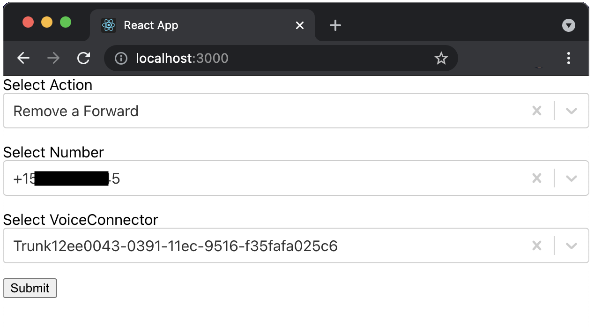

# Call Forwarding with Amazon Chime SDK PSTN Audio service

This demo will build and configure several services within AWS so that you can forward calls using the Amazon Chime SDK, more specifically the [CallAndBridge](https://docs.aws.amazon.com/chime/latest/dg/call-and-bridge.html) action. A local React client can be used to manage the forwarding of numbers.

## Overview


## Requirements

- node V12+/npm [installed](https://www.npmjs.com/get-npm)
- yarn [installed](https://classic.yarnpkg.com/en/docs/install)
  - `npm install --global yarn`
- AWS CLI [installed](https://docs.aws.amazon.com/cli/latest/userguide/install-cliv2.html)
- AWS Credentials [configured](https://docs.aws.amazon.com/cli/latest/userguide/cli-configure-files.html) for the account/region that will be used for this demo
- Ability/Permissions to create Chime SIP Media Applications and Phone Numbers (ensure your [Service Quota](https://console.aws.amazon.com/servicequotas/home/services/chime/quotas) in us-east-1 for Phone Numbers have not been reached)
- Deployment must be done in us-east-1 or us-west-2 to align with SIP Media Application resources

## Deployment

### Back-end Resources

- Clone this repo: `git clone https://github.com/aws-samples/amazon-chime-sma-call-forwarding`
- `cd amazon-chime-sma-call-forwarding`
- `./deploy.sh`
- Accept prompts for CDK deployment

### Local client

- `cd client`
- `yarn`
- `yarn start`

## Description

This deployment will build everything required to forward calls and change numbers between different Amazon Chime Product Types. Phone Numbers within Amazon Chime Phone Inventory can have a Product Type of `SipMediaApplicationDialIn` or `VoiceConnector`. The local client can update the Product Type of the phone numbers in the Phone Inventory and update a DynanamoDB table with call forwarding information. A Voice application Lambda function written in Python is used to forward numbers using the [CallandBridge](https://docs.aws.amazon.com/chime/latest/dg/call-and-bridge.html) action.

## Resources Created

- handlerLambda - A Lambda function written in Python that updates the Product Type of numbers in the Amazon Chime Phone Inventory and adds and removes numbers the DynamoDB table. This is fronted by an API Gateway. 
- smaLambda - A Lambda function written in Python that is associated with the Amazon Chime SDK PSTN Audio service and used to forward calls using the CallandBridge action
- calledNumber - A DynamoDB table used to store where numbers should be forwarded to. Managed by the local client and queried by smaLambda function during call setup
- outgoingWav – An S3 bucket to store wav files for playing customized messages
- PSTN Audio – Amazon Chime PSTN service used to forward calls. Associated with the smaHandler Lambda function
- SIP Media Application rule – Amazon Chime SIP Media Application Rule used to route the provisioned phone number to the smaLambda function
- Voice Connector - Chime Voice Connector used to demonstrate changing Product Types of the phone number
- Phone Number - A number provisioned to use with the SIP Media Application rule

## Additional Resources

- utils\createWav.py - Python script to create wav files using Polly
- wav_files\\\* - wav files uploaded to outgoingWav bucket for use with a PSTN Audio voice application

## Operation

### Background

You can learn more about how to build PSTN-enabled voice applications in the Amazon Chime SDK by consulting our [documentation](https://docs.aws.amazon.com/chime/latest/dg/build-lambdas-for-sip-sdk.html).

### Phone Number Product Types

Within Amazon Chime, a phone number must have one of three Product Types:

- BusinessCalling
- VoiceConnector
- SipMediaApplicationDialIn

In this demonstration, we will not be using the BusinessCalling Product Type but focusing on Voice Connector and SipMediaApplicationDialIn.

To forward a number, we will use the SipMediaApplicationDialIn Product Type to route the call to a new phone number. To do this, we must ensure the number is associated with an Amazon Chime SIP Media Application rule. This will route the call to an associated SIP Media Application. This SIP Media Application will invoke the smaLambda and return an action based on the results of a DynamoDB lookup.

### Changing Product Types

The handlerLambda Lambda function will change Product Types for you based on the current Product Type and if you are adding a forward or removing a forward. To add a forward to a number, it must be changed to the SipMediaApplicationDialIn Product Type. Conversely, to remove a forward, the Product Type should be changed to Voice Connector.

### Forwarding The Number

When a call is placed to the phone number configured with the SipMediaApplicationDialIn Product Type, a SIP Media Application rule will route it to the PSTN Audio service. This will invoke the smaLambda function and the CallAndBridge action will be returned to the PSTN Audio service. This will forward/bridge the incoming PSTN call to a new outbound call to the E.164 number stored in the DynamoDB.

```python
def call_and_bridge_to_pstn(caller_id, destination):
    return {
        'Type': 'CallAndBridge',
        'Parameters': {
            'CallTimeoutSeconds': 30,
            'CallerIdNumber': caller_id,
            'Endpoints':
            [
                {
                    'Uri': destination,
                    'BridgeEndpointType': 'PSTN'
                }
            ]
        }
    }
```

### Client - Forwarding a Number

Using the local React client, forward a phone number to a different number. This creates a SipMediaApplication rule for the phone number to point to your Lambda, and creates a call forward for the number in the DynamoDB table.

- Select 'Forward a Number' Action
- Select a Number
- Enter an E.164 number to forward to


### Client - Removing a Forward

Using the local React client, remove an existing call forward. This removes the phone number entry in the DynamoDB table, removes the SipMediaApplication rule for the phone number, and assigns the phone number to a Voice Connector

- Select 'Remove a Forward' Action
- Select the Number associated with your PSTN Audio voice application
- Select a Voice Connector to associate the number to



## Cleanup

To clean up this demo: `npx cdk destroy`. Additionally, Chime SIP Media Applications, rules, voice connectors, and phone numbers should be manually removed in the Chime Console.
